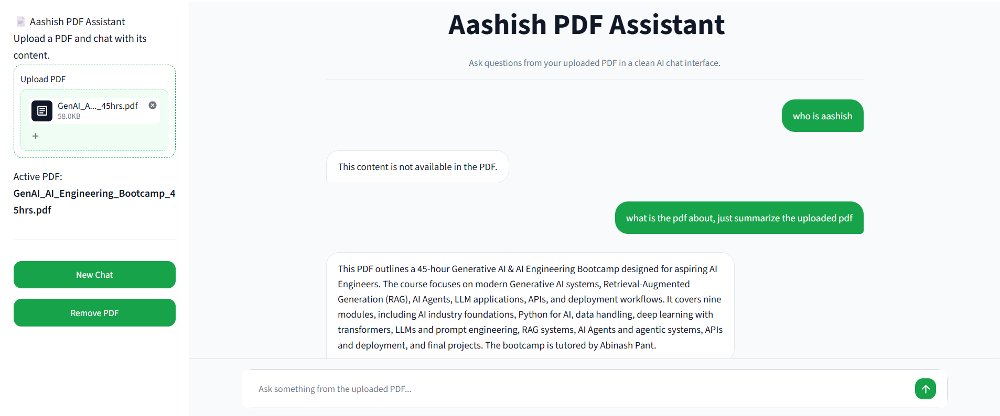

# AI PDF Chatbot

AI PDF Chatbot is a clean and professional chatbot web application built with Streamlit and Gemini API.  
It allows users to upload a PDF file and ask questions based only on the uploaded document.

The system is designed with strict guardrails, PDF-based answering, multi-turn chat support, and a clean ChatGPT-like user interface.

---

## Features

- Upload and chat with PDF files
- Gemini API powered answers
- Clean ChatGPT-like chat interface
- Light theme with green accent color
- User messages right-aligned with green bubble
- Bot replies left-aligned with clean white bubble
- Multi-turn conversation support
- PDF-based answer generation
- Retrieval-based context search using TF-IDF
- Character-level search support for minor spelling mistakes
- Guardrails for harmful, abusive, unsafe, and restricted questions
- Handles questions not available in PDF safely
- Clears PDF memory when the uploaded PDF is removed
- Simple and professional UI built with Streamlit

---

## What This Project Does

This project works as a PDF-based chatbot.

Users can upload any readable PDF such as:

- CV / Resume
- Notes
- Reports
- Documents
- Books
- Academic files
- Business documents

After uploading the PDF, users can ask questions related to that document.  
The chatbot searches the PDF content, finds the most relevant context, and sends only that context to Gemini for generating an answer.

This helps reduce token usage and makes the chatbot more accurate and cost-friendly.

---

## Guardrails and Safety Handling

This project includes strict guardrails before sending the user query to Gemini.

If the user asks harmful, abusive, unsafe, or restricted questions, the system replies:

```txt
This violates our company guidelines.
```

The guardrails protect against:

- Abusive language
- Harmful questions
- Self-harm related questions
- Hacking or malware-related questions
- Internal code requests
- API key or secret key requests
- System prompt leaking
- Jailbreak or bypass attempts

This makes the chatbot safer and more suitable for professional use.

---

## PDF-Based Answer Handling

The chatbot is designed to answer only from the uploaded PDF.

If the user asks a question whose answer is not available in the uploaded PDF, the system replies:

```txt
This content is not available in the PDF.
```

This helps prevent hallucination and avoids giving fake or unrelated answers.

---

## How It Works

The application follows this flow:

```txt
User uploads PDF
        ↓
Text is extracted from PDF
        ↓
PDF text is split into chunks
        ↓
Search index is created using TF-IDF
        ↓
User asks a question
        ↓
System checks guardrails
        ↓
Relevant PDF context is retrieved
        ↓
Gemini generates answer using only retrieved PDF context
        ↓
Answer is shown in chat interface
```

---

## Tech Stack

- Python
- Streamlit
- Gemini API
- Google Gen AI SDK
- PyPDF
- Scikit-learn
- TF-IDF retrieval
- HTML/CSS for custom UI styling

---

## Project Structure

```txt
ai-pdf-chatbot/
│
├── app.py
├── requirements.txt
├── README.md
├── .gitignore
├── .env.example
│
├── assets/
│   └── screenshot.png
│
└── .streamlit/
    └── config.toml
```

---

## UI Preview

Add your screenshot inside the `assets` folder with the name:

```txt
screenshot.png
```

Then it will appear here:



---

## Installation and Setup

### 1. Clone the repository

```bash
git clone https://github.com/aashishadk0/ai-pdf-chatbot.git
cd ai-pdf-chatbot
```

---

### 2. Create virtual environment

```bash
python -m venv venv
```

---

### 3. Activate virtual environment

For Windows:

```bash
venv\Scripts\activate
```

For macOS/Linux:

```bash
source venv/bin/activate
```

---

### 4. Install dependencies

```bash
pip install -r requirements.txt
```

---

## Environment Variables

This project uses a Gemini API key.

Create a `.env` file in the root folder:

```env
api_key=your_gemini_api_key_here
```

Do not push your `.env` file to GitHub.

Instead, this project includes `.env.example` so other developers can understand which key is needed.

---

## `.env.example`

```env
api_key=your_gemini_api_key_here
```

---

## `.gitignore`

```gitignore
.env
__pycache__/
*.pyc
.venv/
venv/
.env.local
.DS_Store
```

---

## `requirements.txt`

```txt
streamlit
python-dotenv
pypdf
scikit-learn
google-genai
```

---

## Streamlit Theme

Create this file:

```txt
.streamlit/config.toml
```

Add:

```toml
[theme]
base = "light"
primaryColor = "#16a34a"
backgroundColor = "#f8fafc"
secondaryBackgroundColor = "#ffffff"
textColor = "#111827"
font = "sans serif"
```

---

## Run the Project

```bash
streamlit run app.py
```

After running the command, open the local Streamlit URL in your browser.

---

## Usage

1. Upload a PDF from the sidebar.
2. Ask questions related to the uploaded PDF.
3. The chatbot replies using only PDF content.
4. Ask follow-up questions in the same chat.
5. Click **New Chat** to clear chat messages.
6. Click **Remove PDF** to remove the uploaded PDF and clear document memory.

---

## Important Notes

- The chatbot works best with text-based PDFs.
- Scanned/image-based PDFs may not work properly because text extraction requires readable PDF text.
- The `.env` file must not be uploaded to GitHub.
- The system does not answer from outside knowledge.
- If the answer is not found in the PDF, it gives a fixed fallback response.
- If the question violates safety rules, it gives a guideline violation response.

---

## Future Improvements

- Add OCR support for scanned PDFs
- Add support for multiple PDFs
- Add user authentication
- Store chat history in database
- Add PDF page references in answers
- Improve semantic search using embeddings
- Deploy on Streamlit Cloud or Render

---

## Author

Developed by **Aashish Adhikari**

---

## License

This project is open-source and available for learning, practice, and portfolio use.
